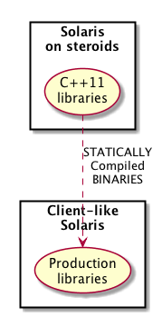

# logs-grammar

Use grammar to parse logs instead of dark regular expression magic.

<!-- java -jar /opt/plantuml/plantuml.jar README.md -o images -->
<!--
@startuml grammar.png
top to bottom direction
skinparam packageStyle rect
actor "Different experts\non several features" as E 
rectangle "Grammar" {
E -left-> (Business\nLogic) : Knownledge\non client's systems 
(Business\nLogic) .> (Grammar\nRules)  
}
note top of (Business\nLogic)
    Knownledge on
expected log entries
end note
note top of (Grammar\nRules)
       Written in a way that
let us resuse them several times
end note
rectangle "Software\nUnder\nTest" as SUT {
(Raw\nLogs)
}
actor "Logs\nAnalytics" as LA
rectangle "Tools" {
(Raw\nLogs)  -down-> (Binary) : complex\nlogs
(Grammar\nRules) -> (Library) : automatic\nbuild
(Library) .> (Binary) 
(Binary) -down-> LA : simpler\nlogs
}
note bottom of (Library)
 Choose at real-time
what libraries to use
end note
@enduml
-->

## Install

In the very beginning, the focus will be on **Linux** platforms for **gcc** and **OSX** for **clang**. As well both compilers can be tested using a more **cloud-friendly way** with [Heroku](https://www.heroku.com) and [TravisCI](https://travis-ci.org).

Later on **Solaris** will be tackle, including *fake* **cross-compilation** for mixing *Solaris* and *gcc* binaries. More or less that idea of [statically linking](http://www.kitware.com/blog/home/post/986) could be used as well with *Linux* boxes.

<!--
@startuml fake-cross-compilation.png
top to bottom direction
rectangle "Solaris\non steroids"  {
(C++11\nlibraries) as C11L 
}
rectangle "Client-like\nSolaris" {
(Production\nlibraries) as PL
}
C11L .> PL : STATICALLY\nCompiled\nBINARIES
@enduml
-->

All that **C++11** code is based on [boost libraries](http://www.boost.org) for features not yet included in current **C++** standard and [dl library](http://www.tldp.org/HOWTO/C++-dlopen) for a plugin approach. The usual [cmake](https://cmake.org) tool for building.

Related to **IDE**'s, **Netbeans** will be tested on **Linux** (local) and **Solaris** (remote). On **OSX** **Xcode** will be used instead.

If there is time left, **Windows** might be tested as well once its planned **clang** support is included on its *Community Edition* for **Visual Studio**. Don't forget to use a **wrapper** for *dl library*.

### OSX

By default we will use **clang** C++ compiler. So install **cmake** and **boost** libraries in a way suits you best, i.e. **brew**, for that compiler. Then the usual *cmake* commands:

       cd logs-grammar
       mkdir build
       cd build
       cmake .. -Wno-dev
       make

**NOTE**: if you happen to work with **Xcode** as **IDE**, remember invoke *cmake* command as:

       cmake -G Xcode .. -Wno-dev

But if you prefer **gcc**, just install the latest compiler version, [build boost](http://qiita.com/misho/items/0c0b3ca25bb8f62aa681) and install those libraries in some custom folder, i.e */opt/boost*. Then in order to apply that configuration:

       cd logs-grammar
       mkdir build
       cd build
       cmake -DCMAKE_C_COMPILER=gcc-5 -DCMAKE_CXX_COMPILER=g++-5  -DBOOST_ROOT=/opt/boost .. -Wno-dev
       make

**NOTE:** if **boost library** wasn't built with extra care for **C++11**, it might come up the annoying warning *deprecrate-declartions* due to obsolete **auto_ptr**.

If you want to cross-compile for **Solaris**:

        ../gcc-5.2.0/configure --target=$TARGET --prefix=$PREFIX --with-sysroot=$SYSROOT --with-gnu-as --with-gnu-ld --disable-libffi --disable-libgcj --disable-zlib --disable-libjava --disable-libcilkrts --disable-libsanitizer --disable-libvtv --disable-libmpx --disable-gnattools --disable-libada --disable-libgfortran --disable-libobjc --disable-liboffloadmic --disable-boehm-gc --enable-languages=c,c++ -v

Libraries have been installed in:

         /opt/cross/sparc-sun-solaris2.10/lib

If you ever happen to want to link against installed libraries
in a given directory, LIBDIR, you must either use libtool, and
specify the full pathname of the library, or use the `-LLIBDIR'
flag during linking and do at least one of the following:
   - add LIBDIR to the `LD_LIBRARY_PATH' environment variable
     during execution
   - add LIBDIR to the `LD_RUN_PATH' environment variable
     during linking
   - use the `-Wl,-rpath -Wl,LIBDIR' linker flag

           /opt/cross/bin/sparc-sun-solaris2.10-gcc -Wl,-rpath -Wl,/opt/cross/sparc-sun-solaris2.10/lib main.c -o hello

           [ctp-1-sevilan-ppin:tecnomen] /tmp> ./hello 
           Hello World!
           [ctp-1-sevilan-ppin:tecnomen] /tmp> ldd ./hello 
           libc.so.1 =>     /usr/lib/libc.so.1
           libm.so.2 =>     /usr/lib/libm.so.2
           /lib/libm/libm_hwcap1.so.2
           /platform/sun4v/lib/libc_psr.so.1

As well, you can try to [**cross-compile**](http://www.boost.org/build/doc/html/bbv2/tasks/crosscompile.html) *boost* libraries themselves to be used at **Solaris**:

          ./bootstrap.sh --with-libraries=all --with-toolset=gcc --prefix=/opt/cross/boost
          ./b2 toolset=gcc target-os=solaris address-model=64 instruction-set=ultrasparc
          sudo ./b2 toolset=gcc target-os=solaris address-model=64 instruction-set=ultrasparc install 
          
**NOTE:** Don't forget to properly configure your **user-config.jam** at your *$HOME* directory:

          # ------------------
          # GCC configuration.
          # ------------------
          # Configure gcc (default version).
          using gcc : sun : sparc-sun-solaris2.10-gcc : <compileflags>-D_XPG6 <linkflags>-D_XPG6 ;
          

### Linux

By default we will use **gcc** C++ compiler. So install **cmake** and **boost** libraries in a way suits you best, i.e. **apt-get** or **yum**, for that compiler. Then the usual *cmake* commands:

       cd logs-grammar
       mkdir build
       cd build
       cmake ..
       make

**NOTE**: if you happen to work with **NetBeans** as **IDE**, remember import the code as a **cmake** project.

If your default compiler is too old, i.e. 4.8.x, you can instal a newer one. For example on a **CentOS** system provided you got *devtoolset-3*, the follow instructions:

       sudo yum install -y devtoolset-3-gcc 
       sudo yum install -y devtoolset-3-gcc-c++

But it might make more sense just compile from sources, similar as for [Cross Compilation](http://www.cis.upenn.edu/~milom/cross-compile.html). Don't forget to meet its [prerequirements](https://gcc.gnu.org/wiki/InstallingGCC)

Another trick is to compile with the option **--with-default-libstdcxx-abi=gcc4-compatible** as explained at [Build GCC5 on RHEL6](http://en.librehat.com/blog/build-gcc-5-dot-2-on-rhel-6/)

       cd <working directory>
       wget http://ftp.gnu.org/gnu/gcc/gcc-5.2.0/gcc-5.2.0.tar.gz
       tar -xvzf gcc-5.2.0.tar.gz
       cd gcc-5.2.0
       ./contrib/download_prerequisites
       cd ..
       mkdir objdir
       cd objdir
       sudo mkdir /opt/gcc
       ./gcc-5.2.0/configure --prefix=/opt/gcc --disable-multilib --disable-libffi --enable-languages=c,c++ -v
       make all
       sudo make install

If you want to **CROSS COMPILE** on Linux for different targets, i.e. Solaris or ARM64, try to store target SYSROOT libraries and cross-compilers in a "logic" way for you. For example:

    /opt/cross
    └── Solaris
        ├── gcc
        │   ├── bin
        │   ├── include
        │   ├── lib
        │   ├── libexec
        │   ├── share
        │   └── sparc-sun-solaris2.10
        └── SYSROOT
            ├── lib
            │   ├── 32 -> .
            │   ├── 64 -> sparcv9
            │   ├── cpu
            │   ├── libm
            │   ├── mpxio
            │   ├── secure
            │   ├── sparcv9
            │   └── svc
            └── usr
                ├── dt
                ├── include
                ├── lib
                ├── local
                ├── openwin
                ├── usr
                └── X11
                
**NOTE**: *gcc* folder stored your cross-compiler, i.e. **binutils**, **gcc**, ..., built using **SYSROOT** libraries [copied from your target machine](http://www.cis.upenn.edu/~milom/cross-compile.html):

        export TARGET=sparc-sun-solaris2.10
        export PREFIX=/opt/cross/Solaris/gcc
        export SYSROOT=/opt/cross/Solaris/SYSROOT

        cd $SYSROOT
        ssh user@solaris "tar -cf - /usr/include" | tar -xvf -
        ssh user@solaris "tar -cf - /usr/local/include" | tar -xvf -
        ssh user@solaris "tar -cf - /lib" | tar -xvf -
        ssh user@solaris "tar -cf - /usr/lib" | tar -xvf -
        ssh user@solaris "tar -cf - /usr/local/lib" | tar -xvf -
        ssh user@solaris "tar -cf - /usr/openwin/include" | tar -xvf -
        ssh user@solaris "tar -cf - /usr/dt/include" | tar -xvf -
        ssh user@solaris "tar -cf - /usr/X11/include" | tar -xvf -
        ssh user@solaris "tar -cf - /usr/openwin/lib" | tar -xvf -
        ssh user@solaris "tar -cf - /usr/dt/lib" | tar -xvf -
        ssh user@solaris "tar -cf - /usr/X11/lib" | tar -xvf -
        ssh user@solaris "tar -cf - /usr/sfw" | tar -xvf -

[Download & compile **binutils** and **gcc**](http://www.cis.upenn.edu/~milom/cross-compile.html) in some building directories:

        cd <<building directory for binutils>>
        ../binutils-2.25/configure --target=$TARGET --prefix=$PREFIX --with-sysroot=$SYSROOT -v
        make all
        sudo make install
        
        cd <<building directory for gcc>>
        ../gcc_5_3_0_release/configure --target=$TARGET --prefix=$PREFIX --with-sysroot=$SYSROOT --with-gnu-as \ 
        --with-gnu-ld --disable-libffi --disable-libgcj --disable-zlib --disable-libjava --disable-libcilkrts \
        --disable-libsanitizer --disable-libvtv --disable-libmpx --disable-gnattools --disable-libada \
        --disable-libgfortran --disable-libobjc --disable-liboffloadmic --disable-boehm-gc --enable-languages=c,c++ -v
        make all
        sudo make install
        
Now check it out with typical C++11/14 program and compile it statically:    

        #include <iostream>
        #include <thread>
        void thread_function()
        {
            std::cout << "thread function\n";
        }
        int main()
        {
            std::thread t(&thread_function);   // t starts running
            std::cout << "main thread\n";
            t.join();   // main thread waits for the thread t to finish
            return 0;
        }

        /opt/cross/Solaris/gcc/bin/sparc-sun-solaris2.10-g++ -std=c++14 \
        -Wl,-rpath -Wl,/opt/cross/Solaris/gcc/sparc-sun-solaris2.10/lib main.cpp \
        -static-libstdc++ -static-libgcc -o crosscompiled_for_Solaris

**NOTE**: *-static-libstdc++* flag is very important in order to include statically **libstdc++.a** in your binary:

        /opt/cross/Solaris/gcc/bin/sparc-sun-solaris2.10-g++ -print-file-name=libstdc++.a
        /opt/cross/Solaris/gcc/lib/gcc/sparc-sun-solaris2.10/5.3.0/../../../../sparc-sun-solaris2.10/lib/libstdc++.a
        
Once you got cross-compile your C++14 binarie statically on your Linux box, you can execute it on your target, i.e. Solaris:

        ldd crosscompiled_for_Solaris 
        libm.so.2 =>     /usr/lib/libm.so.2
        librt.so.1 =>    /usr/lib/librt.so.1
        libc.so.1 =>     /usr/lib/libc.so.1
        libaio.so.1 =>   /usr/lib/libaio.so.1
        libmd.so.1 =>    /usr/lib/libmd.so.1
        /lib/libm/libm_hwcap1.so.2
        /platform/sun4v/lib/libc_psr.so.1
        /platform/sun4v/lib/libmd_psr.so.1
        
        ./crosscompiled_for_Solaris 
        main thread
        thread function

Adding [**cross-compile**](http://www.boost.org/build/doc/html/bbv2/tasks/crosscompile.html) *boost* libraries themselves to be used at **Solaris** is equivalent to **OSX** case:

          ./bootstrap.sh --with-libraries=all --with-toolset=gcc --prefix=/opt/cross/Solaris/gcc/boost
          sudo ./b2 -a --debug-configuration --debug-building --debug-generators toolset=gcc-sun target-os=solaris address-model=64 instruction-set=ultrasparc linkflags="-static -static-libgcc -static-libstdc++" cxxflags=-Wno-unused-variable install 
          
**NOTE:** Don't forget to properly configure your **user-config.jam** at your *$HOME* directory and generated-by-bootstrap.sh *project-config.jam* file:

          # ------------------
          # GCC configuration.
          # ------------------
          # Configure gcc (default version).
          using gcc : sun : /opt/cross/Solaris/gcc/bin/sparc-sun-solaris2.10-g++ : <compileflags>-std=c++14 --sysroot=/opt/cross/Solaris/SYSROOT -m64 -D_XPG6 -static -static-libstdc++ -static-libgcc <linkflags>-std=c++14 --sysroot=/opt/cross/Solaris/SYSROOT -m64 -D_XPG6 -static -static-libstdc++ -static-libgcc ;

**NOTE:** And updated *project-config.jam* file (before running **sudo ./b2 -a ...**):

        # Boost.Build Configuration
        # Automatically generated by bootstrap.sh

        import option ;
        import feature ;

        # Compiler configuration. This definition will be used unless
        # you already have defined some toolsets in your user-config.jam
        # file.
        #if ! gcc in [ feature.values <toolset> ]
        #{
        #    using gcc ; 
        #}

        #project : default-build <toolset>gcc ;

        using gcc : sun : /opt/cross/Solaris/gcc/bin/sparc-sun-solaris2.10-g++ : <compileflags>-std=c++14 --sysroot=/opt/cross/Solaris/SYSROOT -m64 -D_XPG6 -static -static-libstdc++ -static-libgcc <linkflags>-std=c++14 --sysroot=/opt/cross/Solaris/SYSROOT -m64 -D_XPG6 -static -static-libstdc++ -static-libgcc ;

        # List of --with-<library> and --without-<library>
        # options. If left empty, all libraries will be built.
        # Options specified on the command line completely
        # override this variable.
        libraries =  --with-filesystem --with-system ;

        # These settings are equivivalent to corresponding command-line
        # options.
        option.set prefix : /opt/cross/Solaris/gcc/boost ;
        option.set exec-prefix : /opt/cross/Solaris/gcc/boost ;
        option.set libdir : /opt/cross/Solaris/gcc/boost/lib ;
        option.set includedir : /opt/cross/Solaris/gcc/boost/include ;

        # Stop on first error
        option.set keep-going : false ;

This way *cross-compiled* Solaris **boost** libraries will be placed:

        /opt/cross
        └── Solaris
            ├── gcc
            │   ├── bin
                ├── boost
                │   ├── include
                │   │   └── boost
                │   └── lib

Check **boost** librerias out with one elementary example:

        #include <iostream>
        #include <boost/filesystem.hpp>
        int main()
        {
            boost::filesystem::path pathname = "/usr/local/bin";
            std::cout << pathname.string() << std::endl;
            return 0;
        }

Try to compile and link statically all non-pure header libraries:

        /opt/cross/Solaris/gcc/bin/sparc-sun-solaris2.10-g++ -std=c++14 -I/opt/cross/Solaris/gcc/boost/include -L/opt/cross/Solaris/gcc/boost/lib -Wno-deprecated-declarations -Wl,-rpath -Wl,/opt/cross/Solaris/gcc/sparc-sun-solaris2.10/lib:/opt/cross/Solaris/gcc/boost/lib -Wl,-rpath-link -Wl,/opt/cross/Solaris/gcc/sparc-sun-solaris2.10/lib:/opt/cross/Solaris/gcc/boost/lib -static-libstdc++ -static-libgcc -Wl,-Bstatic -lboost_filesystem -lboost_system -Wl,-Bdynamic -lm -lrt -lc main.cpp -o boost_for_Solaris

### Solaris

By default we will use **gcc** C++ compiler. So install **cmake** and **boost** libraries in a way suits you best, i.e. [OpenCSW](https://www.opencsw.org) **pkgutil** against *unstable* mirror, for that compiler. Then the following commands:

       cd logs-grammar
       mkdir build
       cd build
       CC=/opt/csw/bin/gcc CXX=/opt/csw/bin/g++ BOOST_INCLUDEDIR=/opt/csw/gxx/include /opt/csw/bin/cmake .. 
       /opt/csw/bin/make

**NOTE**: Don't forget to hint, i.e. export LD_LIBRARY_PATH=/opt/csw/lib, where to find **gcc** C++11 compiler libraries instead default ones. Later on, we tackle that issue with *statically* built binaries.

## Execute program & unit tests 

Just a **C++11** project, based on **boost** libraries for code and **unit tests**. It's built using **cmake** utility so you can check out binaries with:

       cd logs-grammar/build
       src/logs-grammar

And unit test with:

       cd logs-grammar/build 
       test/unitTest

But you'd better use a more friendly **IDE** as **Xcode** or **NetBeans**.
